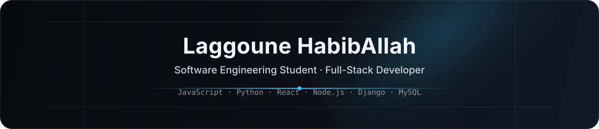



  

  <h1>Laggoune HabibAllah</h1>

  

    <strong>Software Engineering Student · Full-Stack Developer</strong>
  

  

    L3 Software Engineering @ USTHB · Problem Solver · Freelancer
  

  

    <a href="mailto:habiballahlaggoune@gmail.com">Email</a>
    ·
    <a href="https://github.com/habiblne">GitHub</a>
    ·
    <strong>Discord:</strong> habib_lne
  

 

## About Me

I am a software engineering student focused on building practical full-stack applications, solving technical problems, and improving the systems behind reliable digital products.

- L3 Software Engineering @ USTHB
- Full-stack development across web, backend, and databases
- Interested in systems, networks, DevOps, and data-driven software
- Available for freelance development work

 

## Tech Stack

| Languages | Frontend | Backend & Data | Tools |
| --- | --- | --- | --- |
| JavaScript · Python · Java · C · C# · PHP | React · HTML · CSS | Node.js · Django · MySQL | Linux · Git · VS Code · Docker · Figma · Postman |

 

  

 

## Currently / Focus

- Strengthening full-stack architecture and clean implementation habits
- Building projects that balance performance, usability, and maintainability
- Deepening academic foundations in systems, networks, DevOps, and data

 

## GitHub Analytics

  

 

## Contact

  
  
  

